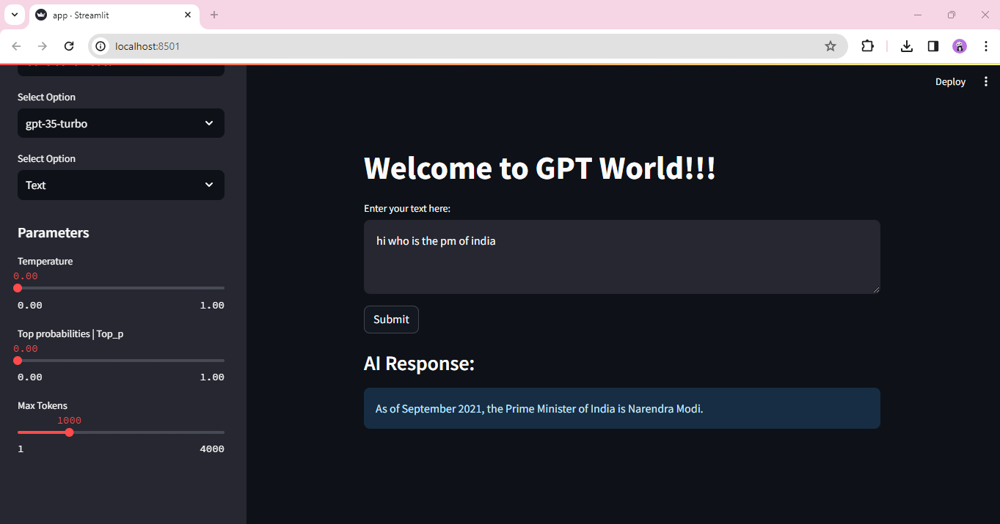
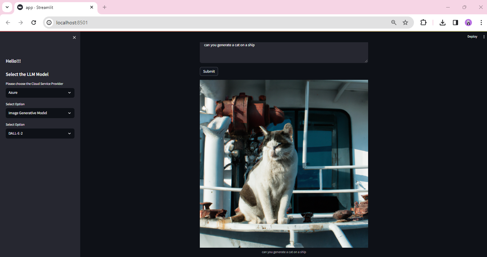
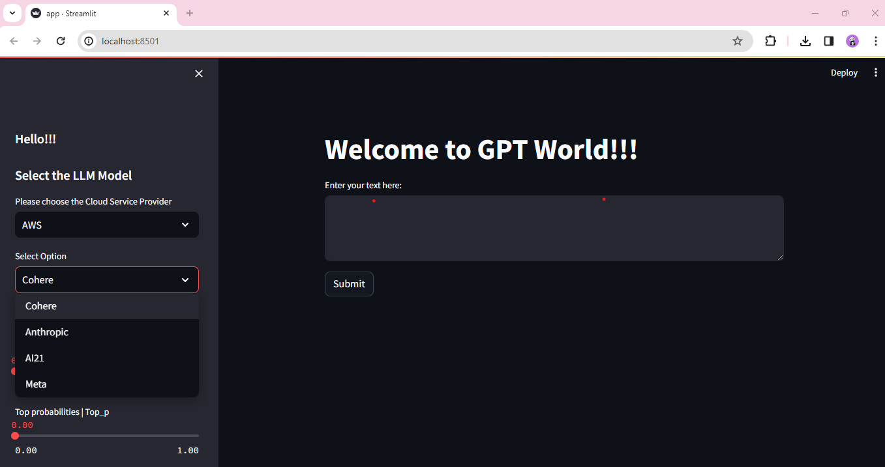

# Best Practices for API Requests with Language Models (LLMs)

As I work with Language Models like OpenAI's GPT models, I ensure to follow best practices for API requests:

- **POST Requests**: I utilize POST requests for generating text or processing large input data. This approach ensures practicality and security by allowing me to include extensive data within the request body.

- **Avoiding Large URLs**: GET requests can result in unwieldy and potentially insecure URLs, especially with substantial data payloads.

## Git Commit Standards

I maintain consistency and clarity in my Git commits by following these commit standards:

- **feat**: Introduce new features.
- **fix**: Address bug fixes.
- **docs**: Documentation changes, such as README updates.
- **style**: Style or formatting adjustments.
- **perf**: Enhancements related to code performance.
- **test**: Implementation of tests for features.

## Handling JSON in Streamlit Apps

In my Streamlit applications, I use the `.json()` method to parse HTTP responses formatted in JSON. This functionality facilitates the conversion of JSON data into Python objects, typically dictionaries or lists.

## Azure Implementation

I integrate Azure's GPT-3.5-Turbo and GPT-4-32k models with modularity in mind to accommodate additional models seamlessly. I implement a singleton architecture to instantiate LLM Objects and clients only once for efficiency.

- **LLM Parameters**:
    1. `top_p`
    2. `temperature`
    3. `max_tokens`

For image generation, I leverage DALL-E 2.

## AWS Integration

For AWS integration, I utilize Boto3, the AWS SDK for Python, to interact with AWS services. I employ Object-Oriented Programming (OOP) to organize models into Cohere, Anthropic, AI21, and Meta categories.

### Cohere
- `cohere.command-text-v14`

### Anthropic
- `anthropic.claude-v1`
- `anthropic.claude-v2`
- `anthropic.claude-instant-v1`

### AI21
- `ai21.j2-ultra-v1`
- `ai21.j2-mid-v1`

### Meta
- `meta.llama2-13b-chat-v1`

I implement a singleton pattern to ensure a single client and object instantiation for each model, enhancing efficiency and resource management.

